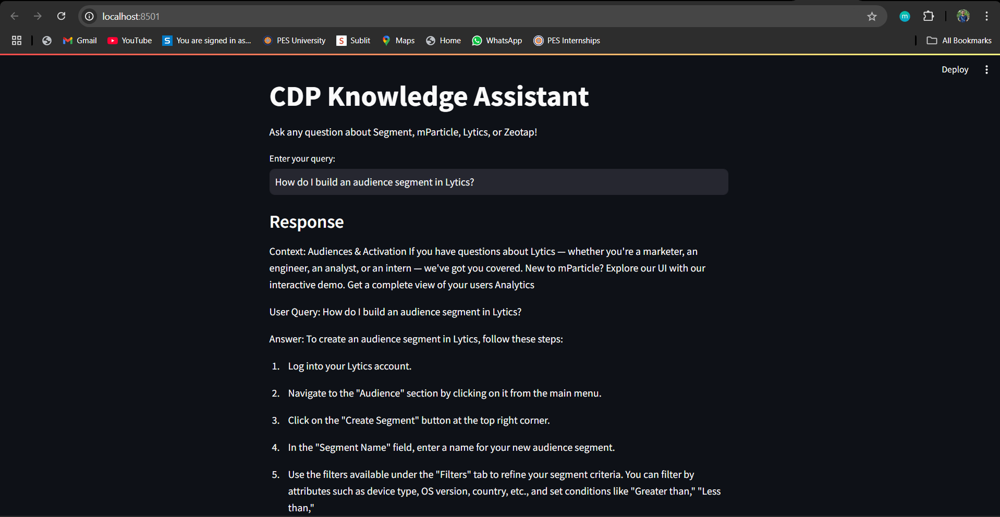

# CDP Knowledge Assistant

Welcome to the **CDP Knowledge Assistant**! This chatbot leverages cutting-edge Natural Language Processing (NLP) techniques to help users retrieve and answer queries from documentation of CDP platforms such as Segment, mParticle, Lytics, and Zeotap. 

## Overview
The CDP Knowledge Assistant is built using:
- Web scraping to collect documentation data.
- Sentence Transformers for embedding generation.
- HDBSCAN clustering to organize documentation into topics.
- Nearest Neighbors for efficient retrieval.
- Qwen 2.5B-Instruct for contextual and accurate query generation.

### Features
1. **Automated Web Scraping**: Extracts and organizes documentation text.
2. **Contextual Query Answering**: Retrieves relevant text chunks based on input queries.
3. **Clustered Data Organization**: Groups similar topics for efficient information retrieval.
4. **Interactive Chatbot Experience**: Real-time interaction using NLP-powered models.

### Screenshot

### [For Live Experience](https://your-live-experience-link.com)



---

## Getting Started
Follow these instructions to set up and run the CDP Knowledge Assistant locally.

### Prerequisites
Ensure you have the following installed:
- Python 3.8 or higher
- pip (Python package manager)

### Installation
1. Clone the repository:
    ```bash
    git clone https://github.com/Tirthraj1605/CDP-Knowledge-Assistant.git
    cd CDP-Knowledge-Assistant
    ```

2. Install the required dependencies:
    ```bash
    pip install -r requirements.txt
    ```

3. Download the Qwen 2.5B-Instruct model and place it in the appropriate directory. You can use Hugging Face's `transformers` library to automate this.

### Required Files
- **`requirements.txt`**: Contains all necessary Python libraries.
- **`chatbot_notebook.ipynb`**: It is a notebook of Chatbot.
- **`streamlit_chatbot.py`**: It's a Chatbot with streamlit frontend.
- **Data Directory**: Contains pre-scraped or clustered data, if applicable.

---

## Usage
1. Run the chatbot:
    ```bash
    streamlit run streamlit_chatbot.py
    ```

2. Interact with the chatbot by typing your queries. Example:
    ```
    Your Query: How do I set up a new source in Segment?
    ```

3. Type `exit` to quit the chatbot.

---

## Project Structure
```
CDP-Knowledge-Assistant/
|-- streamlit_chatbot.py       # Main chatbot script
|-- chatbot_notebook.ipynb     # Chatbot Notebook
|-- requirements.txt           # Python dependencies
|-- README.md                  # Project description
|-- data/                      # Directory to store data and embeddings , if applicable
```

---

## Technologies Used
- **Web Scraping**: `BeautifulSoup`, `requests`
- **Clustering**: `HDBSCAN`
- **Nearest Neighbor Search**: `sklearn`
- **Sentence Transformers**: `all-MiniLM-L6-v2`
- **Language Model**: Qwen 2.5B-Instruct

---

## Acknowledgments and CDP 
- [Segment Documentation](https://segment.com/docs/?ref=nav)
- [mParticle Documentation](https://docs.mparticle.com/)
- [Lytics Documentation](https://docs.lytics.com/)
- [Zeotap Documentation](https://docs.zeotap.com/home/en-us/)
